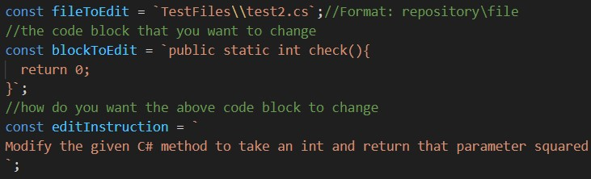
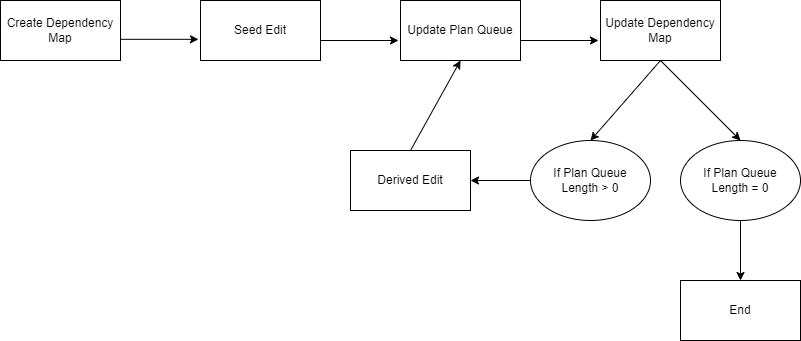

# **LLM-RepoEditor**
---
C# Repo Edit Propagator is a program that allows the user to prompt an LLM to make an edit in a local C# repository. It will then check for dependent code blocks and make edits to them to make sure the repository can compile. It is inspired by Microsoft’s CodePlan (https://arxiv.org/pdf/2309.12499.pdf), a software that uses an LLM to make changes to a repository and make sure it compiles.

---

**How to use**

This chunk of code can be found in the Main.cjs file. For file to edit, you must provide a path to the file you want to edit.
Copy and paste the block of code you want to edit, and give natural language instructions on how you want the blcok to be edited.

---

 The iterative algorithm starts by taking a seed edit from a user. It then creates the dependency map, makes the seed edit, checks if the plan queue should be updated, and updates the dependency map. If the plan queue is not empty, another edit is made, and the plan queue and dependency map are updated again. If the plan queue is empty, the process is ended.
